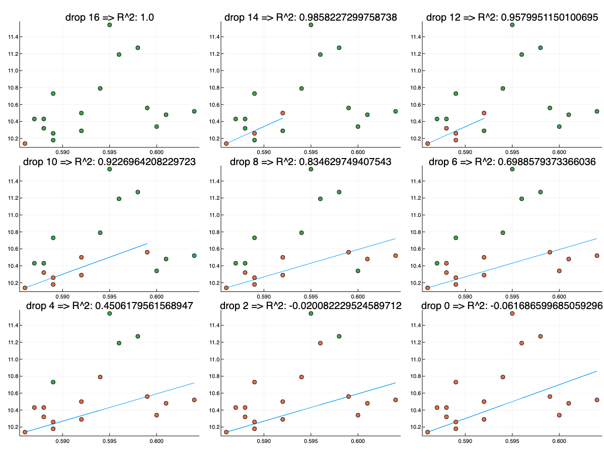

## The model
We use the usual notations in a linear regression problem:

### Notation

- $X$ - data matrix of $n$ samples, where $X = \begin{bmatrix}x_1^T\\...\\x_n^T\end{bmatrix}, x_i \in \mathbb{R}^m, i=1,...,N$
- $y$ - response

### Decision

Now we have the regression model:
$$\hat{y} = \beta^Tx$$

- $\beta$ - model coefficients, $\beta \in \mathbb{R}^m$
- $q$ - $0-1$ decision on whether to keep the sample (else classified as one of the **outliers**)
- $r$ - residue of the estimates:
$r_i = |y_i - \hat{y_i}|$, or $r \ge \|y-\hat{y}\|$, where $\|.\|$ is the $\mathcal{L}_1$ norm


The model minimizes sum of "absolute selected loss":


$$\begin{aligned}\min_{q,r,\beta} L_{\bf abs} &= \sum_i r_i\cdot q_i \\
 &=\begin{bmatrix} r\\q \end{bmatrix}^T\begin{bmatrix} 0 & \frac{1}{2}\mathbf{I}_n\\  \frac{1}{2}\mathbf{I}_n &0 \end{bmatrix}\begin{bmatrix} r\\q \end{bmatrix} & \end{aligned}$$

To make the loss function semi-definite, let:

$$\mathbf{Q} = \lambda\cdot \mathbf{I}_n + \begin{bmatrix} 0 & \frac{1}{2}\mathbf{I}_n\\  \frac{1}{2}\mathbf{I}_n &0 \end{bmatrix} \in \mathcal{S}_{++}$$
whiling setting scaling parameter $\lambda$ properly (say $1$). We have a binary quadratic programming model

$$\begin{aligned}\min_{q,r,\beta} L &=\begin{bmatrix} r\\q \end{bmatrix}^T\mathbf{Q}\begin{bmatrix} r\\q \end{bmatrix} \\ s.t. &\\ &r \ge \|y-X\beta\|_1\\ & \sum_{i=1}^n q_i \ge n_0 &q \in \mathcal{B}^n, n_0 \le n \\\end{aligned}$$

The second set of constraints is the regularization on number of selections, since it's monotonically better to **unselect** a sample, a lower bound $n_0$ is needed.


## Quick results

We now choose $n_0$ experimentally.
The computations are done in the following environment.
```env
- julia 1.4
- gurobi 9.0
```

### Remark

- Gurobi can do the objective directly as above. 
- If you are using Mosek, pls. translate into a conic formulation.


The chart below is the computational results on minimum number of selections vesus $R^2$


